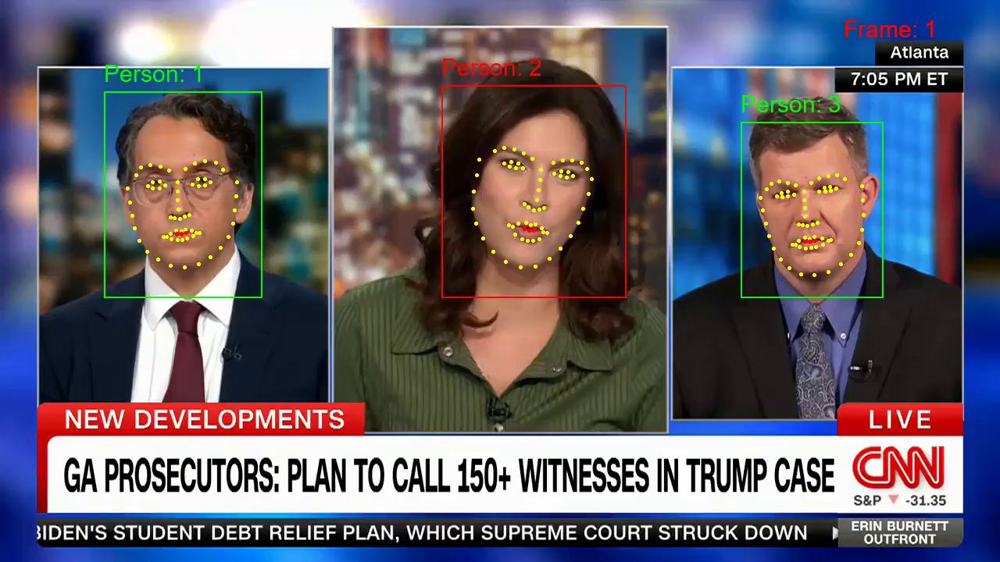

# Multi Person Video2Transcript

This project aimed to develop an AI program to automatically generate transcripts from multi-person videos like YouTube or professional broadcasts, enhancing searchability and keyword generation. Using a combination of CNN, HOG and RNN for speech detection, the system extracts spoken text and produces annotated videos with transcripts. 

## Table of Contents

- [Installation](#installation)
- [Usage](#usage)
  - [Processing a Video](#processing-a-video)
  - [Understanding the Output](#understanding-the-output)
  - [Examples](#Examples)
- [References](#references)
- [License](#license)
## Installation

**Clone the repository**

```bash
git clone https://github.com/RBin789/multi-person-video-transcription.git
```

**Install Dependencies:**

To install the necessary dependencies, you can use the package manager pip. Run the following command in your terminal:

```bash
pip install -r requirements-A3v2.txt
```

This will install all the required packages listed in the `requirements-A3v2.txt` file.  
**Note:** This project uses the library dlib so you will need the C Compiler and CMake  

**Run The Project:**

Once the installation is complete, you can run the project using the following command:

```bash
python main.py
```

That's it! You're ready to use the Multi Person Video2Transcript program. Enjoy!

## Usage

### Processing a Video

To process a video you will need a video and the number of people who appear in the video.  Here are the steps:

1. Start the program
2. Select the video you want to process using the "Open Video" button
3. Put in the number of unqiue people who appear in the video
4. Press "Start" and watch the program process the video

### Understanding the Output

After processing, the program generates two outputs:

#### Annotated Video

An annotated video with bounding boxes, keypoints, and labels for each person is created. Here is an example frame:


   
Key elements in the image:

1. **Bounding Box**: Each face is surrounded by a bounding box and the colour of the box represents weather the program thinks the person is talking or not (Green = Not talking, Red = Talking).
2. **Key Points**: There are 68 keypoints plotted on each face.
3. **Label**: The program's prediction of the person's identity, which is crucial for the transcript.

#### Text Transcript

A text transcript with which person said what and when in terms of frames.  Here is an example:

```
Time 0 to 227 - Person 2:
the judge today so we got you know we all got to see it but i mean you gotta read between the lines what do you think he actually ultimately wants to see happen here

Time 227 to 1028 - Person 3:
hurry area think first and foremost aaron he'd love to see the to speedy trial demands drawn but i don't think that's gonna happen alternatively i think he wants a little bit of our understanding of what's gonna happen with regard to the removal up in federal court i think that was probably his biggest concern that you know they might start a trial for everyone including their potential defend his it might have their case removed and then end up having to remove the case to federal court if that would happen adapt a causes some double jeopardy concerns i'm so i think that's his his biggest issue

Time 1028 to 1074 - Person 2:
is he doesn't want to start they are the other issue

Time 1074 to 1450 - Person 3:
is logistically when you're dealing with nineteen people i mean even trying to find a courtroom big enough to hold a trial like that is gonna be tricky but i mean you eat the other side of that is how them would you like to do this trial twice and each time probably going anywhere from nine months to a year

Time 1450 to 1498 - Person 2:
yeah i mean just to think about that and then
```

### Examples

You can find pre-processed examples at MultiSpeech/videos/example-preprocesed-videos

## References

1. The RNN used to detect lip movment was trained using the code from this [Github Repo](https://github.com/sachinsdate/lip-movement-net "Lip Movement Net")
2. The idea for how to generate face vectors comes from this [Github Repo](https://github.com/N2ITN/Face2Vec "Face2Vec")

## License

Distributed under the MIT License.
